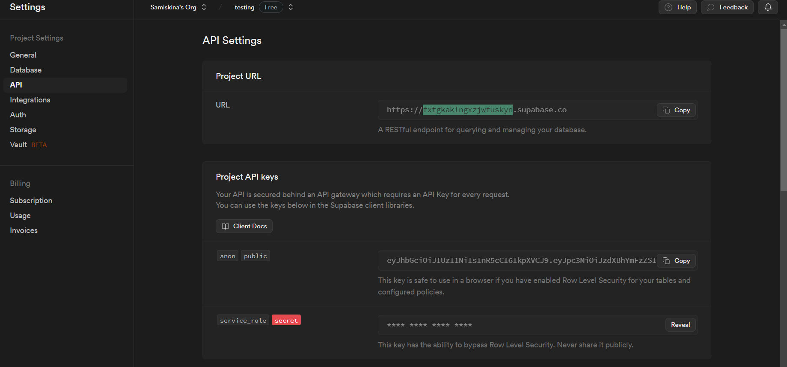

# Vector Database.

A vector database is like a clever tool for sorting words and numbers. Imagine you have lots of words, and you want to organize them based on what they mean or how they're related. Normally, you'd group them by categories, like animals or fruits.

But with a vector database, you organize them based on their similarities. Each group of similar words gets its own special place, and each word is represented by a bunch of numbers that describe these similarities.

So, if you want to find all the words related to 'happy,' you just look in the 'happy' place, and the vector database quickly shows you all the words that are similar in meaning.


## Step by step to create a vector database on Supabase.

1. Create an account on [supabase.com](https://supabase.com/dashboard/sign-in?) if you don't have any.

2. Create new project

### Home page to create new Project


### Click on the button to create a new project


### Form to create a new project


### Click on create new project Button


3. To enable postgres to store vector datatypes we need to extend it.

> Click on slq editor icon, the third menu icon from the top, and run the following query.

### Click the SQL editor button to go to the terminal


### Copy the code in the SQL editor and run


```SQL
create extension if not exists vector with schema public;

-- Create a table to store your chunks
create table chunks (
  id bigserial primary key,
  content text, -- corresponds to Document.pageContent
  metadata jsonb, -- corresponds to Document.metadata
  embedding vector(1536) -- 1536 works for OpenAI embeddings, change if needed
);

-- Create a function to similarity search for chunks
create function match_chunks (
  query_embedding vector(1536),
  match_count int DEFAULT null,
  filter jsonb DEFAULT '{}'
) returns table (
  id bigint,
  content text,
  metadata jsonb,
  similarity float
)
language plpgsql
as $$
#variable_conflict use_column
begin
  return query
  select
    id,
    content,
    metadata,
    1 - (chunks.embedding <=> query_embedding) as similarity
  from chunks
  where metadata @> filter
  order by chunks.embedding <=> query_embedding
  limit match_count;
end;
$$;

-- Create a function to keyword search for chunks
create function kw_match_chunks(query_text text, match_count int)
returns table (id bigint, content text, metadata jsonb, similarity real)
as $$

begin
return query execute
format('select id, content, metadata, ts_rank(to_tsvector(content), plainto_tsquery($1)) as similarity
from chunks
where to_tsvector(content) @@ plainto_tsquery($1)
order by similarity desc
limit $2')
using query_text, match_count;
end;
$$ language plpgsql;
```


## Configure supabase client and openai.

### Supabase
`SUPABASE_PROJECT_ID` `SUPABASE_KEY` are required environment.


1. Click on settings icon on sidebar menu, copy the Reference ID and that's the project id.

### Click on project settings icon on sidebar menu


### Copy the URL as the project ID



2. To get `SUPABASE_PROJECT_ID` click on API.
> Copy only the key with `anon` and `public`.

### Copy the project ID as the KEY


### OpenAI
`OPENAI_API_KEY` assign it with your openapi key.

## Getting Started

### Prerequisites

Ensure the following are installed on your machine:

-   [Node.js](https://nodejs.org/en/download/) (Version 12 or higher)
-   [npm](https://www.npmjs.com/get-npm) (generally bundled with Node.js) or [Yarn](https://yarnpkg.com/getting-started/install)

### Installation

1.  Clone this repository:

    `git clone https://github.com/your-username/vector-database-boilerplate.git`

2.  Move to the project directory:

    `cd vector-database-boilerplate`

3.  Install dependencies:

    `npm install`

    or

    `yarn install`

4.  Create a `.env.local` file in the root directory of the project and include your OpenAI API key:

    `OPENAI_API_KEY=your_openai_api_key`

    Substitute `your_openai_api_key` with your actual OpenAI API key. Your API key can be located in your [OpenAI Dashboard](https://platform.openai.com/account/api-keys).

5.  Kick start the development server:

    `npm run dev`

    or

    `yarn dev`

6.  Access the application by navigating to [http://localhost:3000](http://localhost:3000/). The boilerplate application should be live now.


