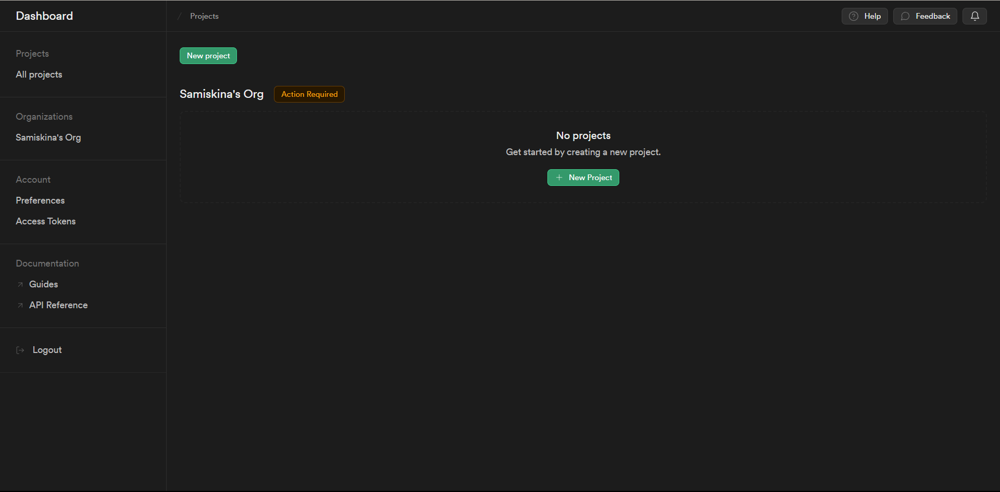
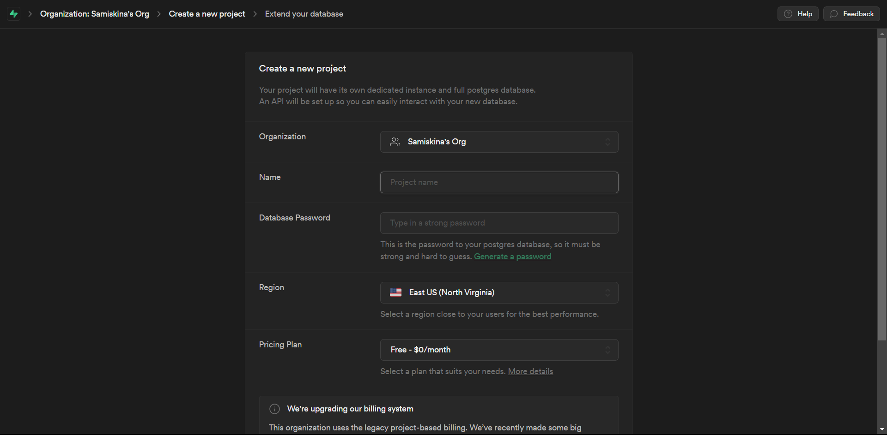
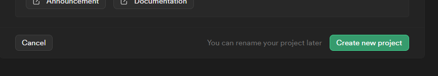
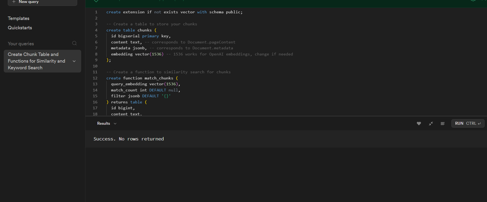
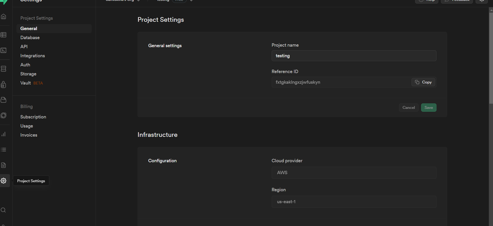
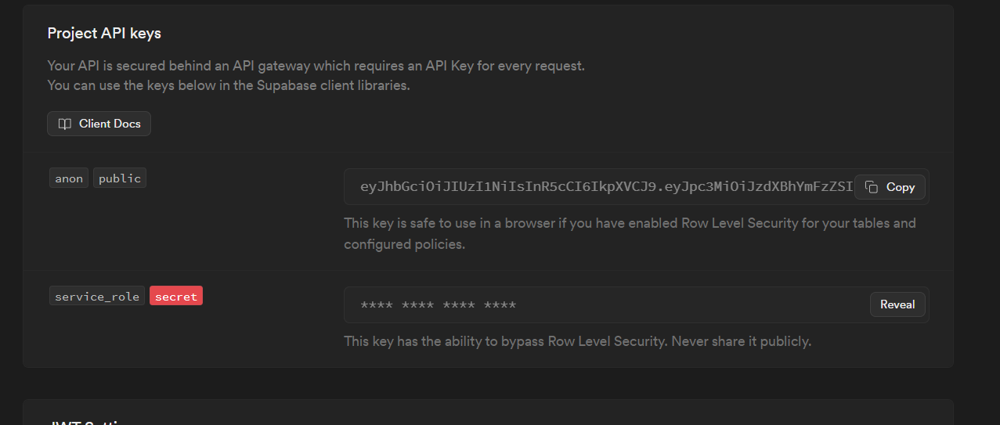
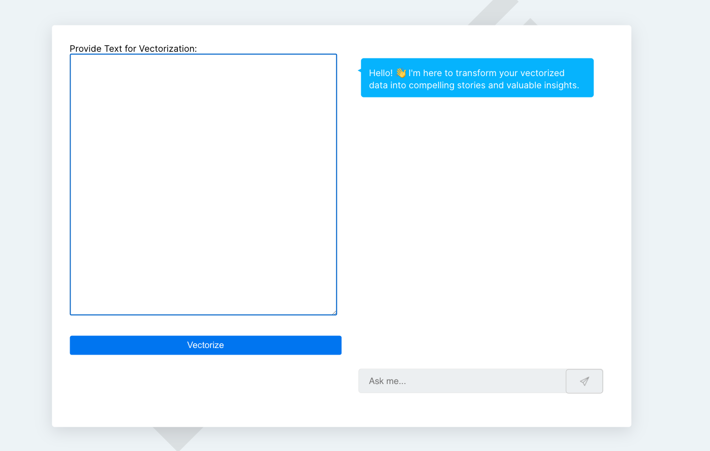

Welcome to this comprehensive course on vector databases, where you will embark on a journey to master the art of harnessing the power of vector databases for various applications.

# What You Will Learn:
Throughout this course, you will acquire the following essential skills:

1. Vector Database Creation and Utilization: You will gain the proficiency to create and effectively utilize vector databases to store and manage your data.

2. Embedding Generation and Integration: Learn the intricacies of generating embeddings and seamlessly integrating them into your vector database, enabling you to work with complex data structures efficiently.

3. Seamless Interaction with Your Vector Database: Discover the techniques and strategies for smooth and intuitive interaction with your vector database, ensuring that you can harness its full potential for your specific needs.

By the end of this course, you'll be equipped with the knowledge and practical skills to leverage vector databases to their fullest extent, empowering you to excel in your data-related endeavors.

# Introduction

## What is a Vector Database?

A vector database is like a clever tool for sorting words and numbers. Imagine you have lots of words, and you want to organize them based on what they mean or how they're related. Normally, you'd group them by categories, like animals or fruits.

But with a vector database, you organize them based on their similarities. Each group of similar words gets its own special place, and each word is represented by a bunch of numbers that describe these similarities.

So, if you want to find all the words related to 'happy,' you just look in the 'happy' place, and the vector database quickly shows you all the words that are similar in meaning.

## What are Embeddings?

Embeddings are like special codes, called vectors, that computers use to understand words and phrases better. These vectors are like arrows pointing in different directions in a big space. Computers use these arrows to figure out which words are similar in meaning and how words can change their meanings in different situations. We use these vector codes to make computers read and understand text, and they're really important for making computers do things like understand language and translate between languages, for example, `[-0.018704185,-0.010303496,0.016113129,-0.005418276,-0.007138899]`. Find more [examples here](./scripts/content/document.csv).

# Prerequisites

Ensure the following are installed on your machine:

- [Node.js](https://nodejs.org/en/download/) (Version 12 or higher)
- [npm](https://www.npmjs.com/get-npm) (generally bundled with Node.js)

# Create Your Own Vector Database on Supabase

1. Create an account on [supabase.com](https://supabase.com/dashboard/sign-in?) if you don't have one.

2. Create a new project on Supabase.

   - Creating a New Project

   

   - Click on the button to create a new project.

   

   

   - Click on the "Create New Project" Button.

   

3. Enable Supabase to Store Vector Datatypes

   Initially, when you create a PostgreSQL database, you are not able to implicitly insert or deal with vector datatypes. To enable PostgreSQL to handle vector databases, follow these steps:

   - Click the SQL editor button.

   

   - Copy the following SQL query into your SQL editor and execute it.

   These queries are from [Langchain](https://js.langchain.com/docs/modules/data_connection/vectorstores/integrations/supabase).

   ```SQL
   -- This line checks if a database extension called 'vector' exists. 
   -- If not, it creates it. Extensions add extra functionality to the database.

   CREATE EXTENSION IF NOT EXISTS vector WITH SCHEMA public;

   -- We're creating a table to store pieces of text, called 'chunks.' Each chunk has:
   -- - An ID that automatically increments and is unique for each chunk.
   -- - The actual text content, which could be, for example, a section of a document.
   -- - Metadata, which is extra information about the chunk stored in JSON format.
   -- - An 'embedding' field for storing vector data, often used for machine learning applications.

   CREATE TABLE chunks (
     id bigserial primary key,
     content text,
     metadata jsonb,
     embedding vector(1536) -- This field can store vectors with 1536 values (dimensions).
   );

   -- Here, we're creating a function for finding similar text chunks.
   -- This function takes a 'query_embedding,' which is a vector representing the text you want to find similar chunks for.
   -- You can also specify how many matching chunks to retrieve with 'match_count.'
   -- You can filter the search using 'filter' based on metadata.

   CREATE FUNCTION match_chunks (
     query_embedding vector(1536),
     match_count int DEFAULT null,
     filter jsonb DEFAULT '{}'
   ) RETURNS TABLE (
     id bigint, -- The ID of matching chunks.
     content text, -- The text content of matching chunks.
     metadata jsonb, -- The metadata of matching chunks.
     similarity float -- A number representing how similar the chunks are to the query.
   )
   LANGUAGE plpgsql
   AS $$
   #variable_conflict use_column
   BEGIN
     -- This is where the magic happens. It calculates the similarity of chunks based on their embeddings.
     -- The chunks that are most similar to the query come first.
     RETURN QUERY
     SELECT
       id,
       content,
       metadata,
       1 - (chunks.embedding <=> query_embedding) AS similarity
     FROM chunks
     WHERE metadata @> filter
     ORDER BY chunks.embedding <=> query_embedding
     LIMIT match_count; -- This limits the number of matching chunks returned.
   END;
   $$;

   -- Finally, we're creating another function for keyword-based search.
   -- It takes a 'query_text' and a 'match_count.'

   CREATE FUNCTION kw_match_chunks(query_text text, match_count int)
   RETURNS TABLE (id bigint, content text, metadata jsonb, similarity real)
   AS $$
   BEGIN
   RETURN QUERY EXECUTE
   FORMAT('SELECT id, content, metadata, ts_rank(to_tsvector(content), plainto_tsquery($1)) AS similarity
   FROM chunks
   WHERE to_tsvector(content) @@ plainto_tsquery($1)
   ORDER BY similarity DESC
   LIMIT $2')
   USING query_text, match_count;
   END;
   $$ LANGUAGE plpgsql;
   ```

   

   After running the query, no rows will be returned, and you will receive a success message.

Now that you have created your own project and vector database, we can proceed to integrate it, create embeddings, upload them, and query the vector database.

# Getting Started


## Using Codespace

On Codespace, installation is automatically triggered.

1. Open this [repository](https://github.com/sezeranoJchrisostome/vector-database-boilerplate) in your

 Codespace.
2. Rename .env.example to .env.
3. To get the values for your environment variables: `OPENAI_API_KEY=`, `SUPABASE_REFERENCE_ID=`, `SUPABASE_PROJECT_API_KEY=`, follow the instructions. 
- Create a `.env` file in the root directory of the project and include your OpenAI API key:

   ```plaintext
   OPENAI_API_KEY=your_openai_api_key
   ```

   Substitute `your_openai_api_key` with your actual OpenAI API key. Your API key can be located in your [OpenAI Dashboard](https://platform.openai.com/account/api-keys).

   Get your Supabase project API key:

   `SUPABASE_REFERENCE_ID` and `SUPABASE_PROJECT_API_KEY` are required environment variables for the Supabase client. To get them, follow these steps:

   1. Click on the settings icon on the sidebar menu, copy the Reference ID, and in your `.env` file, assign it to `SUPABASE_REFERENCE_ID`.

   

   2. To get `SUPABASE_PROJECT_API_KEY`, click on [API](https://supabase.com/dashboard/project/ktrkrjsmtaomgqtvyppm/settings/api), click copy, and assign it to your `SUPABASE_PROJECT_API_KEY` in your `.env` file.

   > Copy only the key with `anon` and `public` labels.

   

5. Kickstart the development server:

   ```
   npm run dev
   ```


### Using Your Local Machine

1. Clone this repository:

   ```
   git clone <repository URL>
   ```

2. Move to the project directory:

   ```
   cd vector-database-boilerplate
   ```

3. Install dependencies:

   ```
   npm install
   ```

4. Create a `.env` file in the root directory of the project and include your OpenAI API key:

   ```plaintext
   OPENAI_API_KEY=your_openai_api_key
   ```

   Substitute `your_openai_api_key` with your actual OpenAI API key. Your API key can be located in your [OpenAI Dashboard](https://platform.openai.com/account/api-keys).

   Get your Supabase project API key:

   `SUPABASE_REFERENCE_ID` and `SUPABASE_PROJECT_API_KEY` are required environment variables for the Supabase client. To get them, follow these steps:

   1. Click on the settings icon on the sidebar menu, copy the Reference ID, and in your `.env` file, assign it to `SUPABASE_REFERENCE_ID`.

   

   2. To get `SUPABASE_PROJECT_API_KEY`, click on [API](https://supabase.com/dashboard/project/ktrkrjsmtaomgqtvyppm/settings/api), click copy, and assign it to your `SUPABASE_PROJECT_API_KEY` in your `.env` file.

   > Copy only the key with `anon` and `public` labels.

   

5. Kickstart the development server:

   ```
   npm run dev
   ```

6. Access the application by navigating to [http://localhost:3000](http://localhost:3000/). The boilerplate application should now be live.

## Interface.
 

## Create Embeddings with Langchain

Langchain provides methods that make the work very easy when dealing with large language models.

`RecursiveCharacterTextSplitter()`: will help you split the content into chunks, and that content will be transformed into vectors or embeddings. At this point, they are called documents.

`SupabaseVectorStore`: This is an instance that merges your Supabase client with the logic of Langchain and the OpenAI model that converts documents into vectors/embeddings. Langchain uploads them to Supabase.

```js
await SupabaseVectorStore.fromDocuments(
    splittedDocs,
    new OpenAIEmbeddings({
        openAIApiKey: process.env.OPENAI_API_KEY,
    }),
    {
        client: supabase,
        tableName: "chunks",
    }
);
```

## Generate Vectors from a Text File

```bash
node ./scripts/uploadEmbedding.js
```

Don't worry about this warning: "No storage option exists to persist the session, which may result in unexpected behavior when using auth. If you want to set `persistSession` to true, please provide a storage option, or you may set `persistSession` to false to disable this warning." Just wait until you see "Uploaded" logged in the terminal.

## Query Our Vector Database

Head over to where our app is running [http://localhost:3000](http://localhost:3000/), and ask any query related to bun, or if you changed the content inside the [document.txt](./scripts/content/document.txt), try to query anything about them.

#### Background Process

```js
/*

This line creates an instance of the SupabaseVectorStore class by calling the fromExistingIndex method. It takes two arguments:
The first argument is an instance of the OpenAIEmbeddings class, which is initialized with an object containing the OpenAI API key.

The second argument is an object with properties client, tableName, and queryName. These properties specify the Supabase client, the name of the table, and the name of the query to be used for retrieving vectors from the Supabase database.

*/

const vectorStore = await SupabaseVectorStore.fromExistingIndex(
    new OpenAIEmbeddings({ openAIApiKey: process.env.OPENAI_API_KEY }),
    { client: supabase, tableName: "chunks", queryName: "match_chunks" }
);

/*

This line creates an instance of the ConversationalRetrievalQAChain class by calling the fromLLM method. It takes two arguments:
The first argument is the model object, which represents the language model to be used for conversational retrieval.
The second argument is the result of calling the asRetriever method on the vectorStore object. This method returns a retriever object that can be used for retrieving vectors from the Supabase database.

*/

const chain = ConversationalRetrievalQAChain.fromLLM(
    model,
    vectorStore.asRetriever()
);

/*

This line calls the call method on the chain object to perform a conversational retrieval. It takes an object as an argument with properties question and chat_history. The question property contains the question to be asked. 
The chat_history property is an array that can be used to provide previous conversation history if needed.

*/
const answer = await chain.call({ question: question, chat_history: [] });

/*
Finally, we deliver the response to the client.
*/

return res.status(200).json({ data: answer });
```

In summary, this course has equipped you with the essential skills to work with vector databases. You've learned how to create, integrate, and query these databases, which will help you manage data more efficiently. With these practical skills, you're ready to utilize vector databases for various applications.
